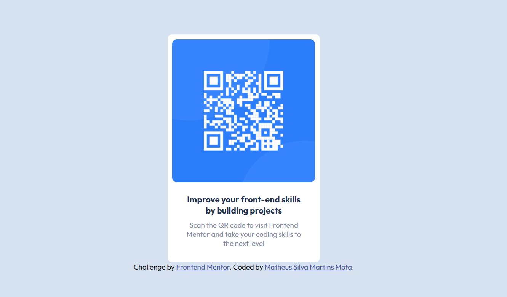

# Frontend Mentor - QR code component solution

This is a solution to the [QR code component challenge on Frontend Mentor](https://www.frontendmentor.io/challenges/qr-code-component-iux_sIO_H). Frontend Mentor challenges help you improve your coding skills by building realistic projects. 

## Table of contents

- [Overview](#overview)
  - [Screenshot](#screenshot)
  - [Links](#links)
- [My process](#my-process)
  - [Built with](#built-with)
  - [What I learned](#what-i-learned)
  - [Continued development](#continued-development)
  - [Useful resources](#useful-resources)
- [Author](#author)
- [Acknowledgments](#acknowledgments)

## Overview

### Screenshot



### Links

- Solution URL: [https://qr-code-component-main-1526zlspi-matheus1714.vercel.app/](https://qr-code-component-main-1526zlspi-matheus1714.vercel.app/)
- Live Site URL: [https://qr-code-component-main-1526zlspi-matheus1714.vercel.app/](https://qr-code-component-main-1526zlspi-matheus1714.vercel.app/)

## My process

### Built with

- Semantic HTML5 markup
- CSS custom properties
- Flexbox
- CSS Grid
- Mobile-first workflow
- [React](https://reactjs.org/) - JS library

### What I learned

I learned that is possible create a components with **Composition** and **Inheritance**.

For composition, I created a children using sub components.  I use this property for create a component `Card`:

```jsx
import React from 'react'
import './Card.css'

export default (props) => {
    return (
        <div className="Card">
            {props.children}
        </div>
    )
}
```

### Continued development

I want to learn to use NextJS and Redux, which are used very often in projects using React.

### Useful resources

- [ReactJS](https://reactjs.org/) - This helped me for write my code react.

## Author

- Website - [Matheus Mota](https://matheus1714.github.io/matheusmota/)
- Frontend Mentor - [@Matheus1714](https://www.frontendmentor.io/profile/Matheus1714)
- Twitter - [@Matheus74220753](https://twitter.com/Matheus74220753)

## Acknowledgments

I am grateful to Leonardo Moura Leitao ([Cod3r](https://www.youtube.com/c/COD3RCURSOS)) who has a channel with incredible content about React and helps me a lot when I have questions.